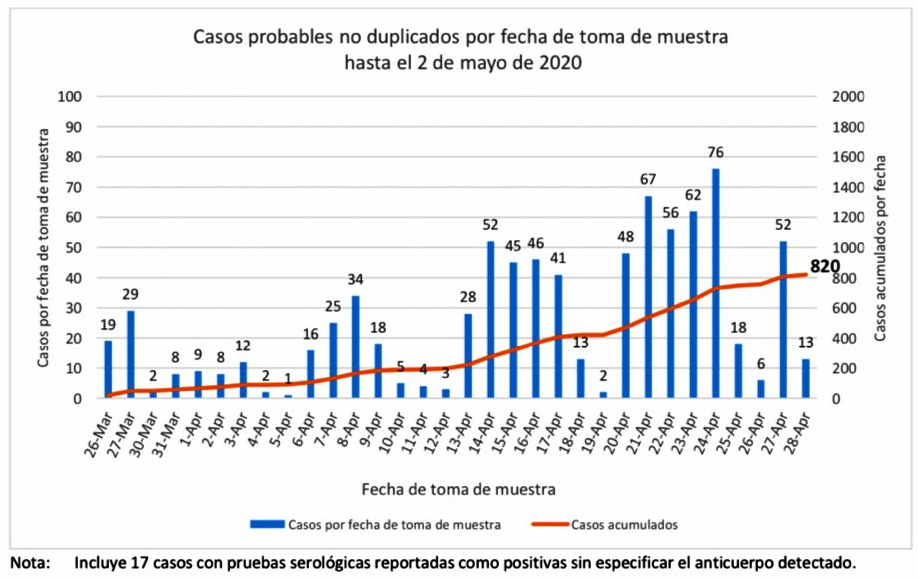
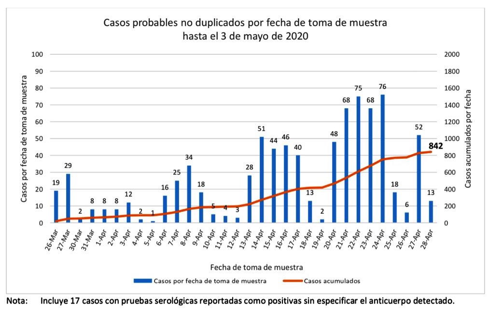

# Datos y análisis del COVID-19 en Puerto Rico

Este proyecto recopila datos sobre COVID-19 publicados por el 
Departamento de Salud de Puerto Rico en un formato legible por
computadora, y contiene algunos análisis de estos.

Visita el dashboard en:

* https://sacundim.github.io/covid-19-puerto-rico/

## Datos de fuente y archivos CSV

Los datos provienen principalmente de:
 
1. Los [informes de Casos Positivos COVID-19](http://www.salud.gov.pr/Estadisticas-Registros-y-Publicaciones/Pages/COVID-19.aspx)
   del Departamento de Salud de Puerto Rico;
2. Descargas diarias del [API del Bioportal del Departamento de Salud de Puerto Rico](Bioportal.md).
3. Publicaciones de datos (principalmente hospitalarios) de [la página HealthData.gov del
   Departamento de Salud y Servicios Humanos de los Estados Unidos](https://healthdata.gov/).
4. El [COVID Tracking Project](https://covidtracking.com/) (hospitalizaciones),
   que a su vez los obtuvo del Departamento de Salud de Puerto Rico y del Departamento de 
   Salud y Servicios Humanos de los Estados Unidos.
5. Fuentes misceláneas como reportes de prensa o informes y gráficas del Departamento de 
   Salud de Puerto Rico que no aparecen en esos enlaces pero que se han compartido con 
   periodistas.

En el directorio [`assets/source_material/`](assets/source_material/)
se recopilan imágenes de boletines y gráficas, según este esquema:

* Archivos PDF originales de los informes en 
  [`assets/source_material/pdf/`](assets/source_material/pdf/);
* Archivos de imágenes extraídos de estos en directorios
  fechados dentro de [`assets/source_material/`](assets/source_material/).

Una selección de datos de estos se ha copiado a mano a los archivos CSV 
en el subdirectorio [`assets/data/`](assets/data/), que incluyen:

* [`PuertoRico-bulletin.csv`](assets/data/cases/PuertoRico-bulletin.csv), que
  consiste de números de "anuncio" que se hacen todos los días.
  Estas son las cifras que más publicidad reciben.
* [`PuertoRico-bitemporal.csv`](assets/data/cases/PuertoRico-bitemporal.csv),
  que consiste de datos de gráficas que acompañan estos boletines
  y que atribuyen las muertes a la fecha en que en verdad sucedieron
  y los casos positivos a la fecha que se tomó la muestra.

Los datos de pruebas vienen de un conjunto de descargas diarias que realizo
del Bioportal del Departamento de Salud de Puerto Rico.  Todas estas descargas
no se comparten aquí pero las guardo en la nube de Amazon (AWS S3) y podrían 
compartirse con quien tenga un interés serio.  También todo el código chapucero
que uso para descargar esos datos y analizarlos está en este repositorio, así 
que quien tenga el conocimiento técnico y se pueda tapar un poco la nariz podría
servirse.

## Análisis de datos de Bioportal

El ordenamiento y análisis de datos del Bioportal de Salud está construido 
usando [Amazon Athena](https://aws.amazon.com/athena/), un servicio de SQL 
en la nube. El "script" principal de limpieza y análisis de datos está
aquí:

* [`aws/athena/run-bioportal-etl.sql`](aws/athena/run-bioportal-etl.sql)

Las visualizaciones finales generalmente hacen otros cálculos adicionales 
a los que hace el código aquí enlazado; especialmente, los cálculos de 
promedios móviles generalmente están en las visualizaciones en vez del SQL.

## Esquema bitemporal

La colección aquí presente de informes diarios de COVID-19 del Departamento 
de Salud de Puerto Rico se ha enfocado en capturar los datos en un llamado 
**esquema bitemporal**, donde se clasifica cada punto por **dos** fechas:

* La fecha de publicación de la cifra (columna `bulletin_date`);
* La fecha del evento que la cifra pretende describir (columna
  `datum_date`).

La intención de esto es posibilitar análisis de, por ejemplo:
 
* Cuándo es que de verdad se realizaron las pruebas o se murieron
  las personas vs. cuándo lo anunció Salud;
* Velar si hay problemas de calidad de datos, por ejemplo si 
  casos que aparecen en boletines más tempranos desaparecen
  de boletines más tardíos (¡que sí ocurre!).

Por ejemplo, esta gráfica de casos positivos probables hasta el 
2 de mayo del 2020 da 9 casos probables para el 1ero de abril:

Pero la gráfica del boletín del próximo día (datos hasta 3 de mayo 
del 2020) da 8 casos probablespara la misma fecha de 1ero de abril:

Así que el archivo bitemporal reporta:

    bulletin_date,datum_date,confirmed_and_probable_cases,confirmed_cases,probable_cases,deaths
    2020-05-02,2020-04-01,80,71,9,3
    2020-05-03,2020-04-01,79,71,8,3

De nuevo, esta recopilación de datos intenta facilitar tales
observaciones.

## Descargador de datos de Salud federal

El código que realiza las descargas periódicas de datos de Salud federal
está en este otro repositorio:

* https://github.com/sacundim/covid-19-puerto-rico-downloader

## Agradecimientos

A Robby Cortés (@RobbyCortes en Twitter) y Angélica Serrano-Román
(@angelicaserran0) que diligentemente publican los boletines del
Departamento de Salud todas las mañanas.

A Danilo Pérez por muchas sugerencias valiosas.

Al Fideicomiso de Salud de Puerto Rico y al Prof. Rafael Irizarry
por facilitar datos sobre pruebas moleculares en Puerto Rico.